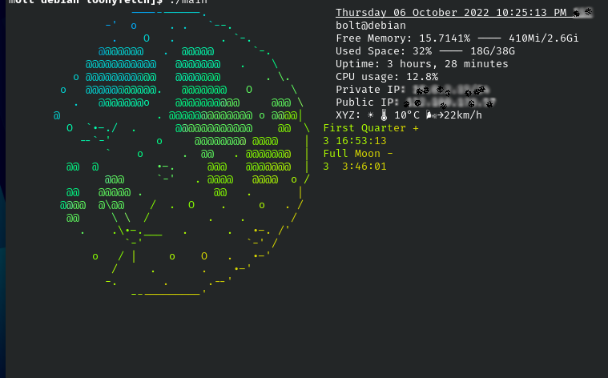
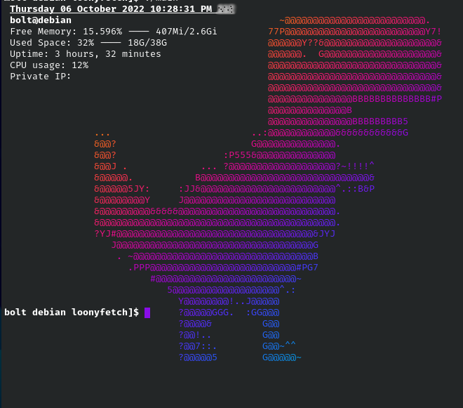
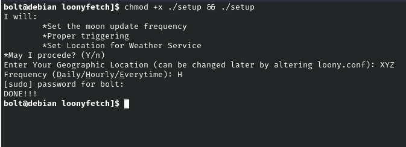

loonyfetch
===================================
**A dynamic light-weight system-information script written in bash**

Also available as `POSIX` compliant script

***INSTALLATION***

Clone the Repository:

    git clone https://github.com/boltzkreig/loonyfetch
    
Change working directory to `loonyfetch`

     cd loonyfetch
     
Make Setup file an executable and Run

     chmod +x setup && ./setup
     
Answer the simple Questionnaire

NOTE: `setup` script is designed to make sure loonyfetch is run on bash startup. This can be undone by manually removing the following line from `.bashrc`

     ~/loonyfetch/main

***DEPENDENCIES***

Needs to be Installed

    * cronie
    * dnsutils for `dig`
    * lolcat
    * curl
	* upower

Weather Service & Moon ASCII 

    * wttr.in

Miscelleneous

    * grep
    * awk
    * sed
    * ip
    & date, whoami, free, df, uptime, ps, tr

***TROUBLESHOOTING***
1. The script take 400ms for initial run. It get quicker and can reach 40ms thereafter.
2. The script can be made faster by disabling weather report by setting the following line in `loony.conf` :
    > location='NULL'
3. If there is doubt about the Moon ASCII to be out-dated run the following command:
    > cd ~loonyfetch/ && ./setup -m
   
   Also the date and time of last update is stamped black-on-black below the ASCII Art.
